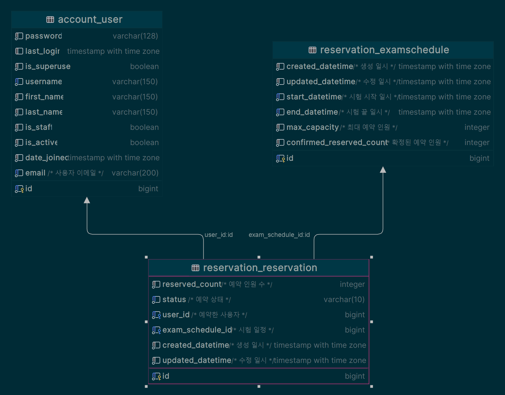

# DB 설계

## 테이블 설계

- 회사, 예약테이블, 시험 일정 테이블

### 사용자

- 이름
- 이메일
- 비밀번호
- 가입일
- 정보 수정일

```python
class User(AbstractUser):
    email = models.EmailField(
        max_length=200, unique=True, db_comment="사용자 이메일"
    )
    username = models.CharField(max_length=200, db_comment="사용자 이름")
    USERNAME_FIELD = "email"
    REQUIRED_FIELDS = ["username"]

    def __str__(self):
        return self.email
```


### 예약(reservation)

- 예약 인원 수
- 예약 상태
- 예약한 사용자
- 시험 일정
- 생성 일시
- 수정 일시

```python
class DefaultFieldModel(models.Model):
    created_datetime = models.DateTimeField(
        auto_now_add=True, db_comment="생성 일시"
    )
    updated_datetime = models.DateTimeField(auto_now=True, db_comment="수정 일시")

    class Meta:
        abstract = True


class Reservation(DefaultFieldModel):
    class Status(models.TextChoices):
        PENDING = "PEND", "pending"
        RESERVED = "RSVD", "reserved"
        CANCLED = "CNCL", "canceled"

    exam_schedule = models.ForeignKey(
        ExamSchedule,
        on_delete=models.CASCADE,
        related_name="reservations",
        db_comment="시험 일정",
    )
    user = models.ForeignKey(
        "account.User",
        on_delete=models.CASCADE,
        related_name="reservations",
        db_comment="예약한 사용자",
    )
    reserved_count = models.PositiveIntegerField(
        validators=[MaxValueValidator(MAXIMUM_RESERVED_COUNT)],
        db_comment="예약 인원 수",
    )
    status = models.CharField(
        default=Status.PENDING,
        max_length=10,
        choices=Status.choices,
        db_comment="예약 상태",
    )
    objects = models.Manager()

    class Meta:
        indexes = [
            models.Index(fields=["status"]),
        ]
        constraints = [
            CheckConstraint(
                check=Q(reserved_count__lte=MAXIMUM_RESERVED_COUNT),
                name="reserved_count_max_value_check",
            )
        ]

```

### 시험 일정 테이블(examscedule)

- 생성 일시
- 수정 일시
- 시험 시작 일시
- 시험 끝 일시
- 최대 예약 인원
- 확정된 예약 인원

```python
class DefaultFieldModel(models.Model):
    created_datetime = models.DateTimeField(
        auto_now_add=True, db_comment="생성 일시"
    )
    updated_datetime = models.DateTimeField(auto_now=True, db_comment="수정 일시")

    class Meta:
        abstract = True
        
        
class ExamSchedule(DefaultFieldModel):
    start_datetime = models.DateTimeField(db_comment="시험 시작 일시")
    end_datetime = models.DateTimeField(db_comment="시험 끝 일시")
    max_capacity = models.PositiveIntegerField(
        default=MAXIMUM_RESERVED_COUNT,
        validators=[MaxValueValidator(MAXIMUM_RESERVED_COUNT)],
        db_comment="최대 예약 인원",
    )
    confirmed_reserved_count = models.IntegerField(
        default=0,
        validators=[MaxValueValidator(MAXIMUM_RESERVED_COUNT)],
        db_comment="확정된 예약 인원",
    )

    objects = models.Manager()

    class Meta:
        indexes = [
            models.Index(fields=["start_datetime"]),
            models.Index(fields=["end_datetime"]),
        ]
        unique_together = [["start_datetime", "end_datetime"]]
        constraints = [
            CheckConstraint(
                check=Q(confirmed_reserved_count__lte=MAXIMUM_RESERVED_COUNT),
                name="confirmed_reserved_count_max_value_check",
            )
        ]

    def __str__(self):
        return (
            f"{self.start_datetime} - {self.end_datetime}: "
            f"{self.confirmed_reservations}/{self.max_capacity}"
        )
```


# ERD

