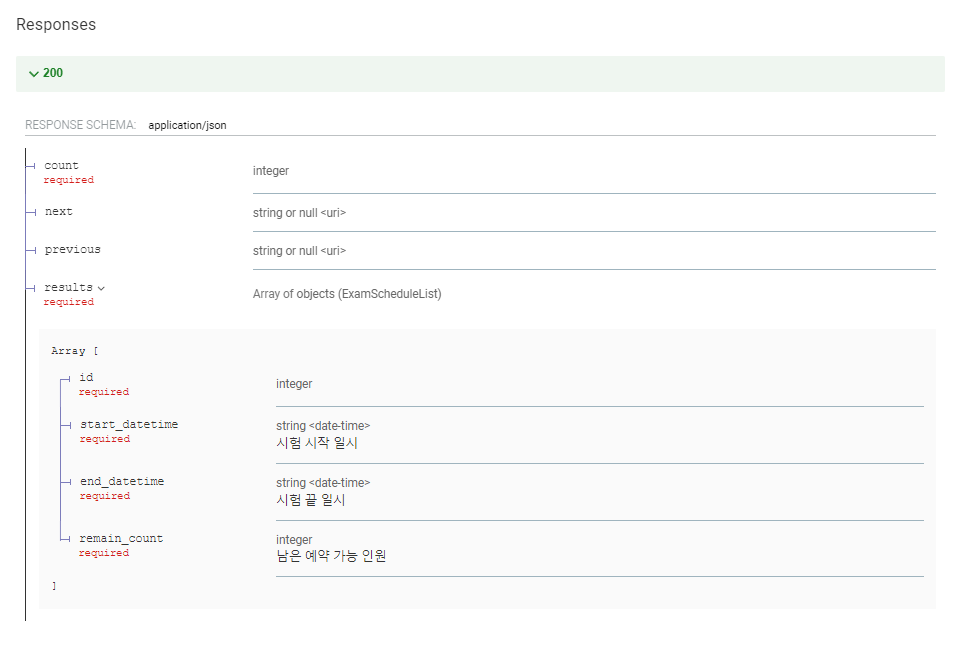
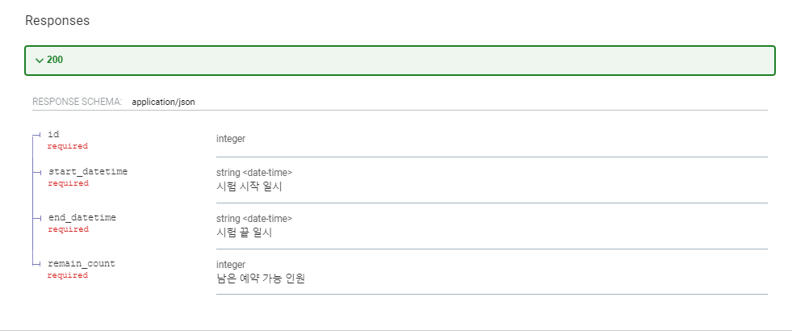

# 예약 기능

## 개발 환경에서 초기 데이터 세팅

- 예약 신청을 할 수 있는 시험 일정을 생성한다.
- 로컬 환경 또는 테스트 환경에서만 사용할 수 있다.

```bash
python manage.py init_exam_schedule --settings=configs.settings.local
```

## 1. 예약 가능 일자 조회

- 사용자는 예약 가능 일자를 조회할 수 있다.
- 관리자도 접근 가능하다.

### Response

- `GET /api/v1/reservation/exam-schedule/`

```json
{
  "count": 123,
  "next": "...",
  "previous": "...",
  "results": [
    {
      "id": 0,
      "start_datetime": "2019-08-24T14:15:22+0000",
      "end_datetime": "2019-08-24T14:15:22+0000", 
      "remain_count": 0
    }
  ]
}
```



- `GET /api/v1/reservation/exam-schedule/:id/`

```json
{
  "id": 1,
  "start_datetime": "2019-08-24T14:15:22+0000", 
  "end_datetime": "2019-08-24T14:15:22+0000",
  "remain_count": 0
}
```




## 2. 고객의 예약 수정 API

1. 고객은 자신의 예약을 수정할 수 있다.
2. 예약 수정은 시험 시작 3일 전까지만 가능하다.
3. 예약 확정이 되면 수정할 수 없다.
4. 예약 수정할 수 있는 날짜는 예약할 수 있는 날짜를 조회하는 API에서 할 수 있다고 본다.
5. 예약 확정되지 않으면 예약 인원에 포함되지 않는다.